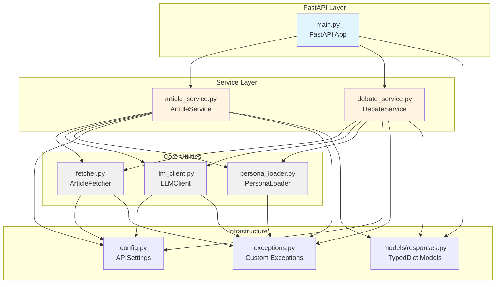
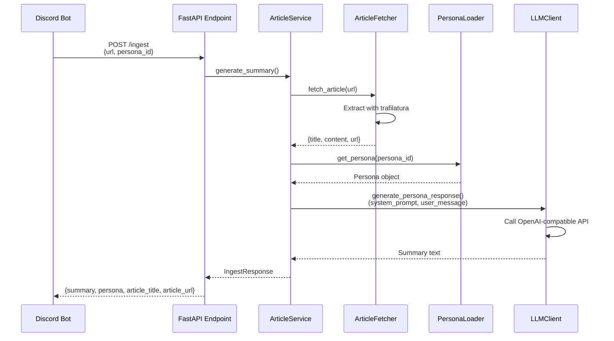
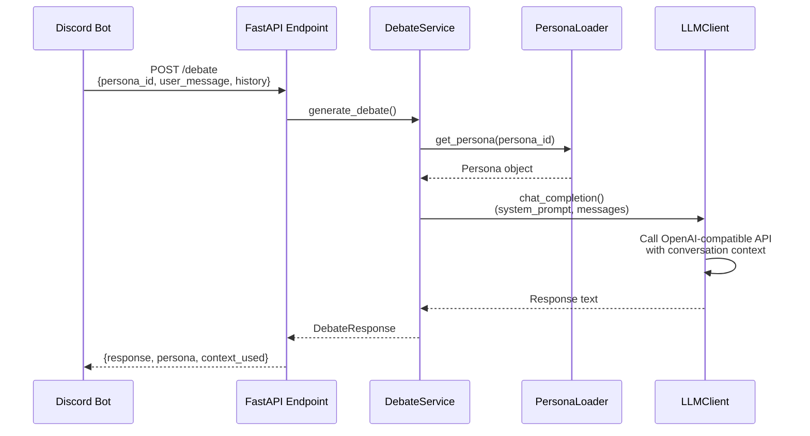

# API Layer Architecture

FastAPIベースのバックエンドAPI。記事の取得・要約、ペルソナベースの会話生成を担当します。

## ディレクトリ構造

```
api/
├── config.py              # 設定管理（Pydantic Settings）
├── exceptions.py          # カスタム例外階層
├── fetcher.py            # 記事抽出（trafilatura）
├── llm_client.py         # LLM API通信（OpenAI互換）
├── main.py               # FastAPIアプリケーション・エンドポイント
├── persona_loader.py     # ペルソナYAMLローダー
├── models/
│   └── responses.py      # レスポンス型定義（TypedDict）
└── services/
    ├── article_service.py    # 記事要約ビジネスロジック
    └── debate_service.py     # 会話生成ビジネスロジック
```

## アーキテクチャ概要

### コンポーネント依存関係図



### リクエストフロー図

#### POST /ingest（記事要約）



#### POST /debate（会話生成）



## 主要コンポーネント

### 1. FastAPI Layer (`main.py`)

エンドポイント定義とHTTPリクエスト処理を担当します。

**エンドポイント:**
- `GET /`: API情報
- `GET /health`: ヘルスチェック
- `POST /ingest`: 記事要約生成
- `POST /debate`: ペルソナ会話応答

**責務:**
- リクエストバリデーション（Pydantic）
- サービス層の呼び出し
- 例外ハンドリング（HTTPException変換）
- CORS設定

### 2. Service Layer

ビジネスロジックを集約し、Core Utilitiesを組み合わせて処理を実行します。

#### `article_service.py` (ArticleService)

記事要約の全体フローを制御:
1. URLから記事本文を抽出
2. ペルソナを選択（指定 or 自動）
3. ペルソナの人格で要約生成
4. レスポンス構築

#### `debate_service.py` (DebateService)

会話応答の全体フローを制御:
1. ペルソナ取得
2. 会話履歴を含めたコンテキスト構築
3. LLMで応答生成
4. レスポンス構築

**設計パターン:**
- 依存性注入（コンストラクタで依存を受け取る）
- 単一責任の原則（各サービスは1つの機能に集中）

### 3. Core Utilities

再利用可能な機能モジュール。シングルトンパターンで提供されます。

#### `fetcher.py` (ArticleFetcher)

**責務:** URLから記事本文を抽出
- trafilaturaライブラリを使用
- 最大文字数で切り詰め（設定可能）
- エラーハンドリング（ArticleFetchError）

**シングルトン:** `get_article_fetcher()`

#### `llm_client.py` (LLMClient)

**責務:** LLM APIとの通信
- OpenAI互換API対応（Qwen, OpenAI, OpenRouter, Azure, Custom）
- 2つのインターフェース:
  - `chat_completion()`: 汎用チャット
  - `generate_persona_response()`: ペルソナ専用（システムプロンプト設定）
- プロバイダー自動切り替え（環境変数）

**シングルトン:** `get_llm_client()`

#### `persona_loader.py` (PersonaLoader)

**責務:** ペルソナ定義の管理
- `api/personas/*.yaml` から読み込み
- Personaデータクラス:
  - id, name, icon, color, description
  - system_prompt, examples
- メソッド:
  - `get_persona(persona_id)`: 個別取得
  - `get_all_personas()`: 全取得
  - `get_persona_choices()`: Discord用選択肢

**シングルトン:** `get_persona_loader()`

### 4. Infrastructure

#### `config.py` (APISettings)

**責務:** 設定の一元管理
- Pydantic Settingsで型安全な設定
- 環境変数読み込み（.env対応）
- デフォルト値とプロパティ提供
  - LLM設定（provider, api_key, model）
  - API設定（host, port, timeout）
  - 記事設定（max_length）
  - 要約設定（min/max_length）

**シングルトン:** `get_settings()`

#### `exceptions.py`

**責務:** カスタム例外階層
- 基底: `LinkPersonaBotError`
- 派生: ArticleFetchError, LLMError, PersonaNotFoundError, etc.
- 詳細情報を`details`辞書で保持

#### `models/responses.py`

**責務:** レスポンス型定義
- TypedDictで型安全性確保
- 主な型:
  - `PersonaInfo`
  - `IngestResponse`
  - `DebateResponse`
  - `HealthResponse`
  - `ErrorResponse`

## データフロー

### 全体フロー

```
HTTP Request
    ↓
FastAPI Endpoint (main.py)
    ↓
Service Layer (article_service / debate_service)
    ↓
Core Utilities (fetcher / llm_client / persona_loader)
    ↓
External APIs (Web / LLM)
    ↓
Response Construction (TypedDict Models)
    ↓
HTTP Response (JSON)
```

### エラーハンドリング

```
Core Utilities
    → Custom Exception (ArticleFetchError, LLMError, etc.)
    ↓
Service Layer
    → Exception propagation
    ↓
FastAPI Endpoint
    → HTTPException conversion
    ↓
Client
    → HTTP Error Response (4xx, 5xx)
```

## アーキテクチャパターン

1. **レイヤードアーキテクチャ**: Endpoint → Service → Utility
2. **依存性注入**: サービスは依存をコンストラクタで受け取る
3. **シングルトンパターン**: Utility層は`get_*()`関数でシングルトン提供
4. **リポジトリパターン**: PersonaLoaderがデータソース（YAML）を抽象化
5. **ストラテジーパターン**: ペルソナごとに異なる振る舞い（system_prompt）
6. **ファサードパターン**: サービス層が複雑な処理を単純なインターフェースで提供

## 開発ガイドライン

### 新しいエンドポイントを追加する場合

1. `models/responses.py` にレスポンス型を定義
2. `services/` に新しいサービスクラスを作成
3. `main.py` にエンドポイントを追加
4. サービス層でCore Utilitiesを組み合わせてビジネスロジックを実装

### 新しいペルソナを追加する場合

1. `api/personas/新しいペルソナ.yaml` を作成
2. コード変更は不要（自動的に読み込まれます）

### LLMプロバイダーを変更する場合

1. `.env` で `LLM_PROVIDER`, `LLM_API_KEY`, `LLM_MODEL` を設定
2. コード変更は不要（環境変数で自動切り替え）

## テスト戦略

- **Utility層**: モック不要のユニットテスト（fetcher, persona_loader）
- **LLMClient**: モックLLM APIでユニットテスト
- **Service層**: 依存を注入してモックでユニットテスト
- **Endpoint層**: TestClientで統合テスト

## パフォーマンス考慮事項

- **シングルトン**: 初期化コストを1回のみに抑制
- **非同期処理**: async/awaitで I/O バウンドな処理を効率化
- **タイムアウト**: LLM APIリクエストにタイムアウト設定
- **記事切り詰め**: 最大2000文字でLLMコスト削減
