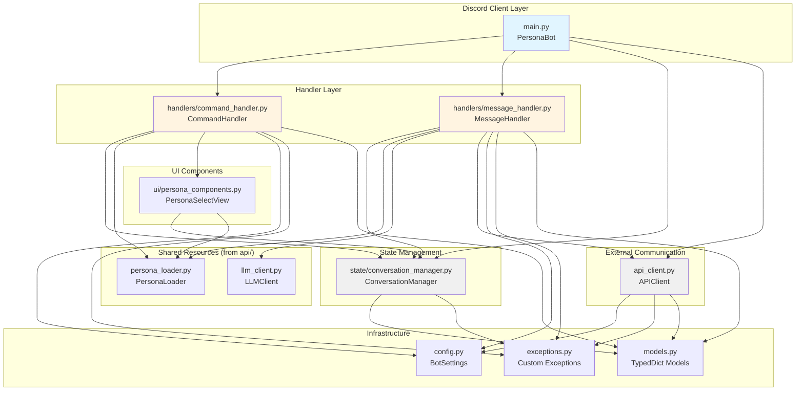
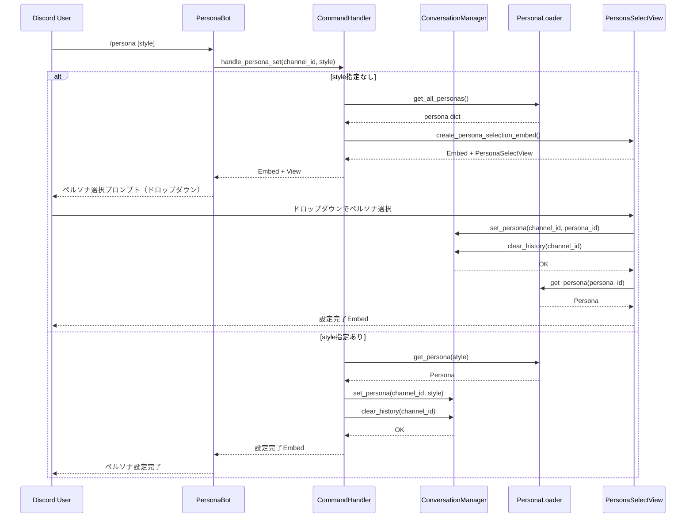
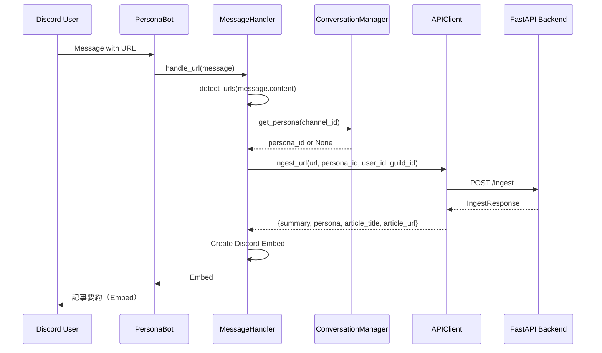
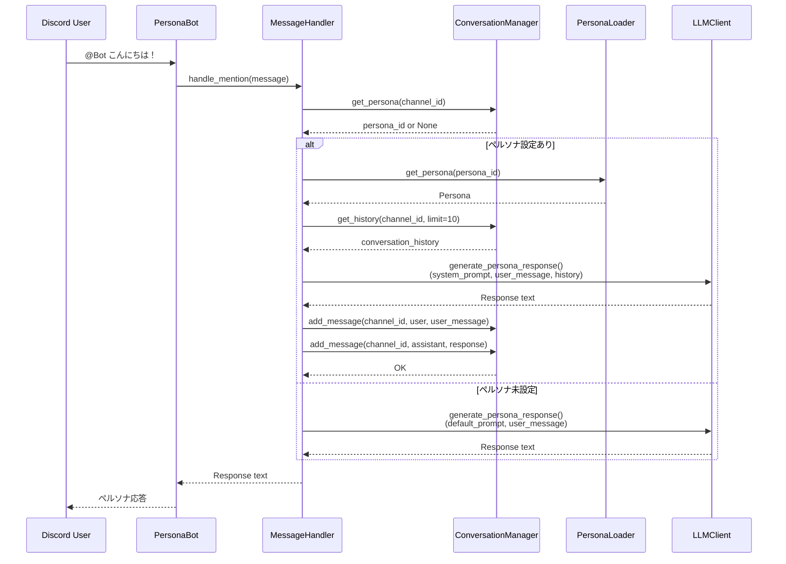

　# Bot Layer Architecture

Discord Botフロントエンド。ユーザーからのコマンドやメッセージを処理し、APIバックエンドと連携してペルソナベースの応答を生成します。

## ディレクトリ構造

```
bot/
├── api_client.py         # FastAPI通信クライアント
├── config.py            # Bot設定管理（Pydantic Settings）
├── exceptions.py        # Bot固有例外
├── main.py              # Discord Bot メインアプリケーション
├── models.py            # 型定義（TypedDict）
├── handlers/
│   ├── command_handler.py    # スラッシュコマンド処理
│   └── message_handler.py    # メッセージイベント処理
├── state/
│   └── conversation_manager.py  # チャンネル状態・会話履歴管理
└── ui/
    └── persona_components.py    # Discord UIコンポーネント（ドロップダウン等）
```

## アーキテクチャ概要

### コンポーネント依存関係図



### イベントフロー図

#### 1. スラッシュコマンド: /persona [style]



#### 2. URL検出フロー



#### 3. メンション応答フロー



## 主要コンポーネント

### 1. Discord Client Layer (`main.py`)

Discord Botのエントリーポイントと全体制御を担当します。

#### PersonaBotクラス

**責務:**
- Discord クライアント初期化
- コマンド登録（slash commands）
- イベントリスナー（`on_message`, `on_ready`）
- 依存コンポーネントの初期化と注入

**ライフサイクル:**
1. `__init__()`: 依存関係を初期化
   - ConversationManager
   - PersonaLoader
   - LLMClient
   - APIClient
   - CommandHandler
   - MessageHandler

2. `setup_hook()`: コマンドツリーをDiscordに同期

3. `on_ready()`: Bot起動ログ

4. `on_message()`: メッセージイベントルーティング
   - Bot自身のメッセージは無視
   - URL検出 → `_handle_url_message()`
   - メンション検出 → `_handle_mention_message()`

**スラッシュコマンド:**
- `/persona [style]`: ペルソナ設定・表示・リセット

### 2. Handler Layer

Botのビジネスロジックを担当。イベント処理を責務ごとに分離しています。

#### `command_handler.py` (CommandHandler)

**責務:** スラッシュコマンドの処理

**依存:**
- ConversationManager: 状態管理
- PersonaLoader: ペルソナ情報取得

**メソッド:**
- `handle_persona_set(channel_id, style)`: ペルソナ設定
  - `style`なし → 選択プロンプト返却
  - `style`あり → 即座に設定、履歴クリア
- `handle_persona_reset(channel_id)`: ペルソナと履歴のリセット
- `handle_persona_get(channel_id)`: 現在のペルソナ情報取得
- `create_persona_selection_embed()`: 選択UI作成

**戻り値:** Discord Embed + View（オプショナル）

#### `message_handler.py` (MessageHandler)

**責務:** メッセージイベントの処理

**依存:**
- ConversationManager: 状態・履歴管理
- PersonaLoader: ペルソナ情報取得
- LLMClient: 直接LLM呼び出し（メンション応答用）
- APIClient: バックエンドAPI呼び出し（URL要約用）

**メソッド:**
- `handle_url(message)`: URL検出→記事要約
  1. URLを抽出（`detect_urls()`）
  2. 現在のペルソナIDを取得
  3. APIClientで`/ingest`を呼び出し
  4. Embedを作成して返却

- `handle_mention(message)`: メンション→会話応答
  1. ペルソナID取得
  2. 会話履歴取得（最新10件）
  3. LLMClientで応答生成
  4. 履歴に追加（ユーザー＋アシスタント）
  5. テキストを返却

- `detect_urls(text)`: 正規表現でURL抽出

**プライベートメソッド:**
- `_respond_with_persona()`: ペルソナ設定時の応答生成
- `_respond_without_persona()`: デフォルト応答生成

### 3. State Management (`state/conversation_manager.py`)

チャンネルごとの状態（ペルソナ、会話履歴）を管理します。

#### ConversationManager クラス

**責務:**
- チャンネル→ペルソナのマッピング管理
- チャンネルごとの会話履歴保持
- 履歴サイズ制御（最大20件保存、LLMには最新10件送信）

**データ構造（インメモリ）:**
- `_channel_personas: dict[int, str]` - チャンネルID → ペルソナID
- `_conversation_history: dict[int, list[ConversationMessage]]` - チャンネルID → 会話履歴

**メソッド:**

**ペルソナ管理:**
- `set_persona(channel_id, persona_id)`: ペルソナ設定
- `get_persona(channel_id)`: 現在のペルソナID取得
- `reset_persona(channel_id)`: ペルソナリセット

**会話履歴管理:**
- `add_message(channel_id, role, content)`: メッセージ追加（最大20件）
- `get_history(channel_id, limit=10)`: 履歴取得（デフォルト10件）
- `clear_history(channel_id)`: 履歴クリア

**統計:**
- `get_channel_state(channel_id)`: チャンネル状態取得
- `get_stats()`: 全体統計（チャンネル数、履歴総数）

**注意:** インメモリストレージのため、Bot再起動で全データ消失

### 4. External Communication (`api_client.py`)

FastAPIバックエンドとのHTTP通信を担当します。

#### APIClient クラス

**責務:** RESTful API呼び出しとエラーハンドリング

**設定:**
- `base_url`: 環境変数から自動構築（`http://{API_HOST}:{API_PORT}`）
- `timeout`: デフォルト30秒

**メソッド:**
- `ingest_url(url, persona_id, user_id, guild_id)`: POST /ingest
  - 記事要約リクエスト
  - 戻り値: `IngestResponse`

- `debate(persona_id, user_message, conversation_history)`: POST /debate
  - 会話応答リクエスト
  - 戻り値: `DebateResponse`

**エラーハンドリング:**
- HTTPエラー → `APIClientError` に変換
- タイムアウト → `APIClientError` に変換
- JSON parse error → `APIClientError` に変換

**プライベートメソッド:**
- `_make_request(method, endpoint, data)`: 汎用HTTPリクエスト

**シングルトン:** `get_api_client()`

### 5. UI Components (`ui/persona_components.py`)

Discord UIコンポーネント（ドロップダウン、Embed）を提供します。

#### PersonaSelectView

**責務:** ペルソナ選択ドロップダウンUI

**コンポーネント:**
- `PersonaSelect`: ドロップダウンメニュー（discord.ui.Select）
  - 全ペルソナを選択肢として表示
  - ユーザー選択時のコールバック処理

**動作:**
1. ユーザーがドロップダウンでペルソナ選択
2. `callback()`: ConversationManagerにペルソナ設定＋履歴クリア
3. 設定完了Embedを返信

**ヘルパー関数:**
- `create_persona_embed(persona, description)`: ペルソナ情報のEmbed作成
  - アイコン、名前、色を反映
  - タイトル、説明文を設定

### 6. Infrastructure

#### `config.py` (BotSettings)

**責務:** Bot設定の一元管理

**設定項目:**
- `discord_token`: Discord Bot トークン（必須）
- `api_host`: APIホスト（デフォルト: localhost）
- `api_port`: APIポート（デフォルト: 8000）
- `conversation_max_history`: 最大履歴保存数（20）
- `conversation_context_limit`: LLMに送信する履歴数（10）
- `command_timeout`: コマンドタイムアウト（30秒）

**シングルトン:** `get_settings()`

#### `exceptions.py`

**責務:** Bot固有の例外階層

**例外:**
- 基底: `BotError`
- 派生:
  - `CommandExecutionError`: コマンド実行失敗
  - `MessageHandlingError`: メッセージ処理失敗
  - `URLDetectionError`: URL検出失敗
  - `PersonaNotFoundError`: ペルソナ未検出
  - `DiscordAPIError`: Discord API エラー
  - `ConversationHistoryError`: 履歴管理エラー
  - `APIClientError`: API通信エラー

#### `models.py`

**責務:** Bot層の型定義

**TypedDict:**
- `PersonaInfo`: ペルソナ情報
- `IngestRequest` / `IngestResponse`: 記事要約リクエスト・レスポンス
- `DebateRequest` / `DebateResponse`: 会話リクエスト・レスポンス
- `ConversationMessage`: 会話メッセージ（role, content）
- `ChannelState`: チャンネル状態（persona_id, history）

## データフロー

### 全体フロー

```
Discord Event (Command / Message)
    ↓
PersonaBot.on_message() / slash command
    ↓
Handler Layer (CommandHandler / MessageHandler)
    ↓
State Management (ConversationManager)
    ↓
External Communication
    ├─ APIClient → FastAPI Backend
    └─ LLMClient → LLM API (direct)
    ↓
Response Construction (Discord Embed / Text)
    ↓
Discord API (Reply / Send Message)
```

### 状態管理フロー

```
User Action
    ↓
Handler
    ↓
ConversationManager.set_persona() / add_message()
    ↓
In-Memory Storage Update
    ↓
ConversationManager.get_persona() / get_history()
    ↓
Handler
    ↓
Response Generation
```

## アーキテクチャパターン

1. **イベント駆動アーキテクチャ**: Discord イベントをトリガーに処理開始
2. **ハンドラーパターン**: イベントごとに専用ハンドラーで処理
3. **依存性注入**: ハンドラーは依存をコンストラクタで受け取る
4. **ステートフルサービス**: ConversationManagerがチャンネル状態を保持
5. **アダプターパターン**: APIClientがHTTP通信をTypedDictインターフェースに変換
6. **コマンドパターン**: スラッシュコマンドをCommandHandlerに委譲
7. **MVCパターン**: PersonaBotがController、Handlerが業務ロジック、UIがView

## Bot ⇔ API 連携

### 共有モジュール

Bot層はAPI層のモジュールを直接インポートして使用:
- `api.persona_loader` (PersonaLoader): ペルソナ定義の共有
- `api.llm_client` (LLMClient): メンション応答時の直接LLM呼び出し

### HTTP通信

URL要約や将来的な機能では、HTTP経由でAPIバックエンドと通信:
- `APIClient.ingest_url()` → `POST /ingest`
- `APIClient.debate()` → `POST /debate`

### アーキテクチャ上の考慮点

**利点:**
- PersonaLoaderを共有することで、ペルソナ定義の一貫性を保証
- LLMClientの直接利用で、メンション応答の低レイテンシを実現

**トレードオフ:**
- Bot層がAPI層に依存（結合度が高い）
- 将来的には全てHTTP経由にすることでマイクロサービス化も可能

## 開発ガイドライン

### 新しいスラッシュコマンドを追加する場合

1. `main.py` の`PersonaBot`クラスに`@app_commands.command`デコレータでコマンド定義
2. `CommandHandler`に処理メソッドを追加
3. 必要に応じて`ConversationManager`や`PersonaLoader`を利用
4. Discord Embedを返却

### 新しいメッセージイベント処理を追加する場合

1. `MessageHandler`に処理メソッドを追加
2. `main.py`の`on_message()`で新しいトリガー条件を追加
3. 適切なハンドラーメソッドを呼び出し

### ペルソナUIをカスタマイズする場合

1. `ui/persona_components.py`の`create_persona_embed()`を編集
2. Embedのフィールド、色、アイコンをカスタマイズ

## テスト戦略

- **Handler層**: モックのConversationManager, PersonaLoader, APIClientでユニットテスト
- **ConversationManager**: 状態管理のユニットテスト
- **APIClient**: モックHTTPレスポンスでユニットテスト
- **統合テスト**: Discord.pyのテストフレームワークで実際のイベント処理をテスト

## パフォーマンス考慮事項

- **インメモリ状態管理**: 高速だが再起動で消失（永続化が必要ならRedis/DBを検討）
- **会話履歴制限**: 最大20件保存、LLMには10件送信でトークン数制御
- **非同期処理**: Discord.py + async/awaitで効率的なI/O処理
- **タイムアウト設定**: API呼び出しとLLM呼び出しにタイムアウトを設定

## 今後の拡張案

1. **永続化**: ConversationManagerをRedis/DBバックエンドに置き換え
2. **マイクロサービス化**: 全てのLLM呼び出しをAPI経由に統一
3. **ボタンUI**: ドロップダウンだけでなくボタン操作も追加
4. **権限管理**: 特定ロール限定コマンドの実装
5. **統計ダッシュボード**: チャンネル別利用統計の可視化
