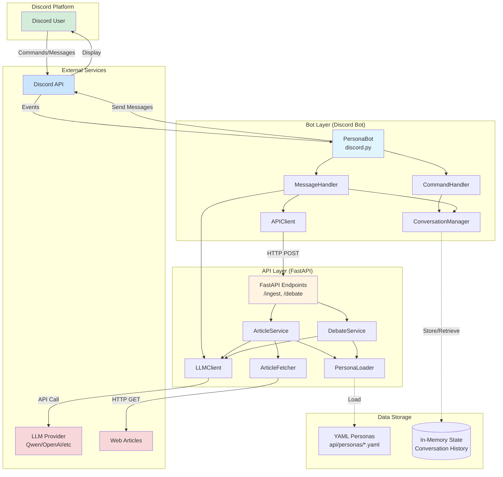
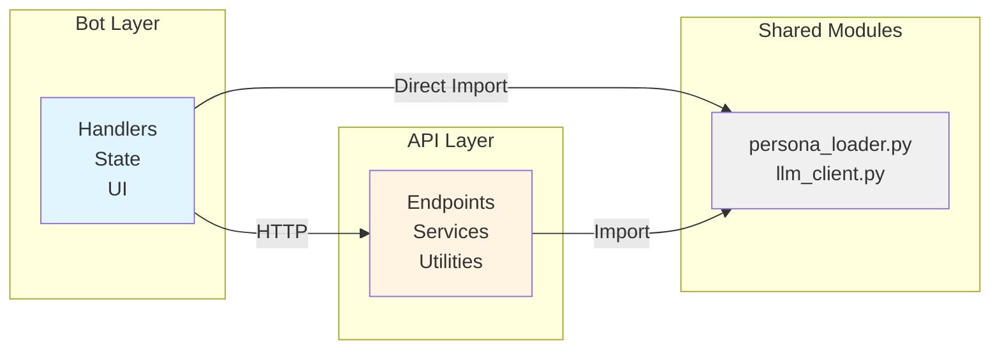
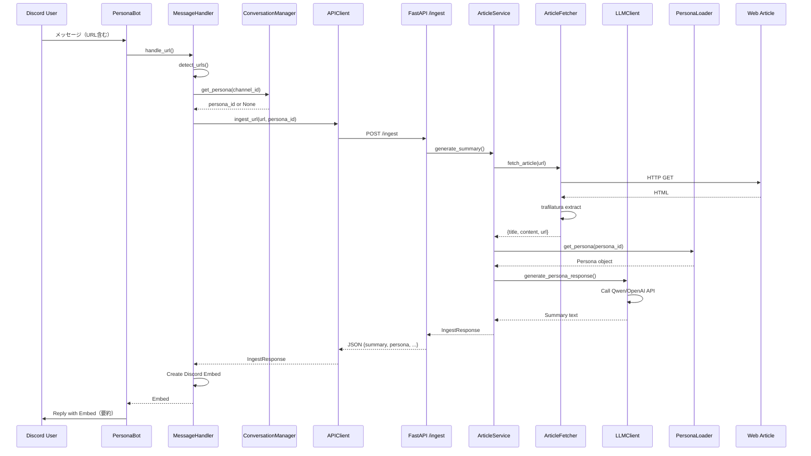
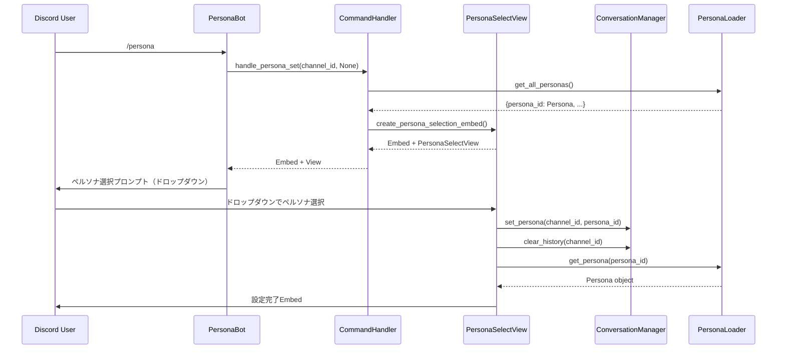
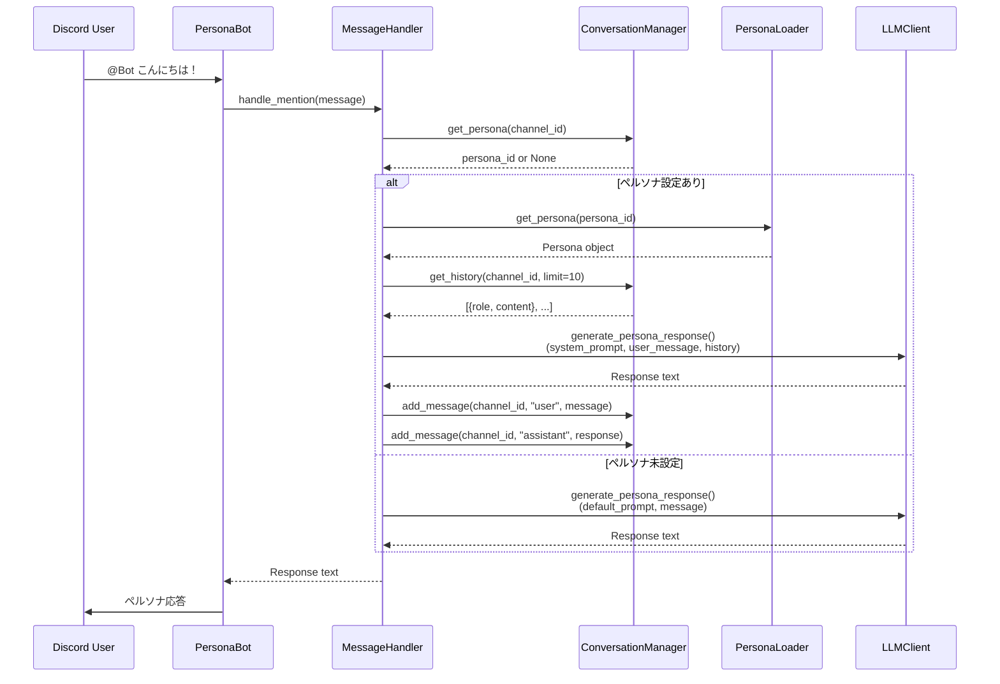
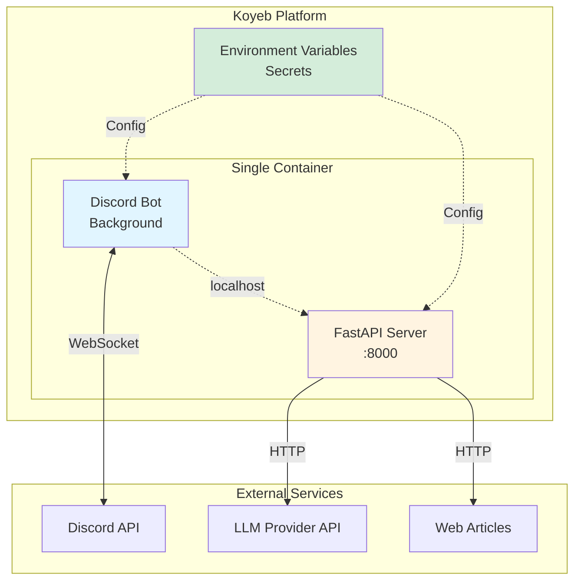

# システムアーキテクチャ

Link Persona Bot のシステムアーキテクチャ全体像を説明します。

## 目次

1. [システム概要](#システム概要)
2. [アーキテクチャ全体図](#アーキテクチャ全体図)
3. [2層アーキテクチャ](#2層アーキテクチャ)
4. [主要データフロー](#主要データフロー)
5. [技術スタック](#技術スタック)
6. [ディレクトリ構成](#ディレクトリ構成)
7. [デプロイメント構成](#デプロイメント構成)
8. [アーキテクチャパターン](#アーキテクチャパターン)
9. [セキュリティ考慮事項](#セキュリティ考慮事項)
10. [パフォーマンス考慮事項](#パフォーマンス考慮事項)

---

## システム概要

Link Persona Bot は、**Discord Bot フロントエンド（Bot層）** と **FastAPI バックエンド（API層）** の2層アーキテクチャで構成されるアプリケーションです。

### 主要機能

1. **URL記事要約（F101）**
   - DiscordでURL投稿 → 記事を抽出・要約 → ペルソナの人格で応答

2. **ペルソナチャット（F201）**
   - `/persona` コマンドでキャラクター切り替え → メンション応答で会話

3. **会話記憶（F302）**
   - チャンネルごとにペルソナ設定と会話履歴を保持（最大20件）

### 設計原則

- **責務の分離**: Bot層（UIロジック）とAPI層（ビジネスロジック）を明確に分離
- **型安全性**: TypedDictとPydanticで型チェック
- **テスタビリティ**: 依存性注入により各コンポーネントを独立してテスト可能
- **拡張性**: YAMLベースのペルソナ定義、環境変数でのLLMプロバイダー切り替え

---

## アーキテクチャ全体図

### システム全体構成



### レイヤー間の通信



**通信方式:**
1. **HTTP通信**: Bot → API（`/ingest`, `/debate`エンドポイント）
2. **共有モジュール**: 両層が`api/`配下のモジュールを直接インポート
   - `persona_loader.py`: ペルソナ定義の共有
   - `llm_client.py`: Bot層でのメンション応答に使用

---

## 2層アーキテクチャ

### Bot層（Discord Bot Frontend）

**責務:**
- Discord イベントの監視と処理
- ユーザーインタラクション（コマンド、メッセージ、UI）
- チャンネルごとの状態管理（ペルソナ、会話履歴）
- API層への HTTP リクエスト

**主要コンポーネント:**
- `PersonaBot`: Discord クライアント、イベントルーター
- `CommandHandler`: スラッシュコマンド処理
- `MessageHandler`: メッセージイベント処理
- `ConversationManager`: チャンネル状態・会話履歴管理
- `APIClient`: FastAPI バックエンドとの HTTP 通信
- `PersonaSelectView`: Discord UI コンポーネント（ドロップダウン）

**詳細:** [`bot/README.md`](../bot/README.md) を参照

### API層（FastAPI Backend）

**責務:**
- RESTful API エンドポイント提供
- ビジネスロジック（記事要約、会話生成）
- 外部サービス連携（Web記事取得、LLM API）
- ペルソナ定義の管理

**主要コンポーネント:**
- `FastAPI`: エンドポイント定義（`/ingest`, `/debate`, `/health`）
- `ArticleService`: 記事要約ビジネスロジック
- `DebateService`: 会話生成ビジネスロジック
- `ArticleFetcher`: Web記事抽出（trafilatura）
- `LLMClient`: LLM API 通信（OpenAI互換）
- `PersonaLoader`: ペルソナYAML管理

**詳細:** [`api/README.md`](../api/README.md) を参照

---

## 主要データフロー

### 1. URL記事要約フロー（F101）



**主な処理時間:**
- Web記事取得: 1-3秒
- LLM要約生成: 2-5秒
- **合計目標: 10秒以内**

### 2. ペルソナ設定フロー（F201）



### 3. メンション応答フロー（F201 + F302）



---

## 技術スタック

### プログラミング言語・フレームワーク

| レイヤー | 技術 | バージョン | 用途 |
|---------|------|-----------|------|
| Bot層 | Python | 3.12+ | プログラミング言語 |
| Bot層 | discord.py | 2.4.0+ | Discord Bot SDK |
| API層 | FastAPI | 0.115.12+ | RESTful API フレームワーク |
| API層 | Uvicorn | 0.34.0+ | ASGI サーバー |
| 共通 | Pydantic | 2.10.6+ | データバリデーション |

### 外部サービス・ライブラリ

| カテゴリ | 技術 | 用途 |
|---------|------|------|
| LLM API | Qwen / OpenAI / OpenRouter | 要約生成、会話応答 |
| Web記事抽出 | trafilatura | HTML → テキスト抽出 |
| HTTP通信 | httpx | 非同期HTTPクライアント |
| YAML | PyYAML | ペルソナ定義の読み込み |

### インフラ・デプロイメント

| 技術 | 用途 |
|------|------|
| Koyeb | 本番環境ホスティング（無料枠） |
| Docker | コンテナ化（オプション） |
| uv | パッケージ管理・ビルド |

### 開発ツール

| 技術 | 用途 |
|------|------|
| uv | 高速パッケージマネージャー |
| pytest | テストフレームワーク |
| ruff | リンター・フォーマッター |
| mypy | 型チェック |

---

## ディレクトリ構成

```
link-persona-bot/
├── api/                          # API層（FastAPIバックエンド）
│   ├── __init__.py
│   ├── config.py                 # 設定管理（Pydantic Settings）
│   ├── exceptions.py             # カスタム例外階層
│   ├── fetcher.py               # 記事抽出（trafilatura）
│   ├── llm_client.py            # LLM API通信（OpenAI互換）
│   ├── main.py                  # FastAPIアプリケーション
│   ├── persona_loader.py        # ペルソナYAMLローダー
│   ├── README.md                # API層アーキテクチャドキュメント
│   ├── models/
│   │   ├── __init__.py
│   │   └── responses.py         # レスポンス型定義（TypedDict）
│   ├── personas/                # ペルソナ定義（YAML）
│   │   ├── anime_otaku.yaml
│   │   ├── default.yaml
│   │   ├── professor.yaml
│   │   └── sarcastic_journalist.yaml
│   └── services/                # ビジネスロジック層
│       ├── __init__.py
│       ├── article_service.py   # 記事要約サービス
│       └── debate_service.py    # 会話生成サービス
│
├── bot/                         # Bot層（Discord Botフロントエンド）
│   ├── __init__.py
│   ├── api_client.py            # FastAPI通信クライアント
│   ├── config.py                # Bot設定管理
│   ├── exceptions.py            # Bot固有例外
│   ├── main.py                  # Discord Bot メインアプリケーション
│   ├── models.py                # 型定義（TypedDict）
│   ├── README.md                # Bot層アーキテクチャドキュメント
│   ├── handlers/                # イベントハンドラー
│   │   ├── __init__.py
│   │   ├── command_handler.py   # スラッシュコマンド処理
│   │   └── message_handler.py   # メッセージイベント処理
│   ├── state/                   # 状態管理
│   │   ├── __init__.py
│   │   └── conversation_manager.py  # 会話履歴・ペルソナ管理
│   └── ui/                      # Discord UIコンポーネント
│       ├── __init__.py
│       └── persona_components.py    # ドロップダウン、Embed
│
├── docs/                        # ドキュメント
│   ├── 01.project.md            # プロジェクト要件定義
│   ├── 02.architecture.md       # システムアーキテクチャ（本ドキュメント）
│   └── 03.deployment.md         # デプロイメントガイド
│
├── tools/                       # 開発ツール
│   └── test/                    # 接続テストスクリプト
│       ├── test_discord_connection.py
│       └── test_llm_connection.py
│
├── .env.example                 # 環境変数テンプレート
├── .gitignore
├── CLAUDE.md                    # Claude Code向けプロジェクトガイド
├── pyproject.toml               # プロジェクト設定（uv管理）
├── README.md                    # プロジェクトREADME
├── REFACTORING_SUMMARY.md       # リファクタリング記録
└── start.sh                     # 本番起動スクリプト
```

### 設計上の特徴

1. **明確な層分離**: `api/` と `bot/` でレイヤーを分離
2. **サービス層**: `api/services/` でビジネスロジックを集約
3. **ハンドラー分離**: `bot/handlers/` でイベント処理を責務ごとに分割
4. **状態管理の独立**: `bot/state/` で会話履歴管理を分離
5. **UI層の独立**: `bot/ui/` でDiscord UIコンポーネントを分離
6. **型定義の明確化**: `models/` と `models.py` で型を一元管理
7. **ドキュメントの階層化**: 全体（`docs/`）、層ごと（`api/README.md`, `bot/README.md`）

---

## デプロイメント構成

### 本番環境（Koyeb）



**起動プロセス（`start.sh`）:**
```bash
# 1. APIサーバーをバックグラウンドで起動
uv run python -m api.main &

# 2. 数秒待機（APIサーバー起動完了を待つ）
sleep 5

# 3. Discord Botをフォアグラウンドで起動
uv run python -m bot.main
```

**環境変数:**
- `DISCORD_TOKEN`: Discord Bot トークン
- `LLM_PROVIDER`: LLMプロバイダー（qwen/openai/etc）
- `LLM_API_KEY`: LLM APIキー
- `LLM_MODEL`: 使用モデル（qwen-plus/gpt-4/etc）
- `API_HOST`: APIホスト（localhost）
- `API_PORT`: APIポート（8000）

### 開発環境

**API単体起動:**
```bash
uv run python -m api.main
```

**Bot単体起動:**
```bash
uv run python -m bot.main
```

**Docker開発:**
```bash
docker compose up -d
docker compose logs -f api
```

---

## アーキテクチャパターン

### 全体アーキテクチャ

1. **レイヤードアーキテクチャ（Layered Architecture）**
   - Bot層（プレゼンテーション）↔ API層（ビジネスロジック）↔ 外部サービス

2. **クライアント・サーバーパターン**
   - Bot（クライアント） → API（サーバー）の明確な分離

3. **マイクロサービス的アプローチ**
   - 2つの独立したプロセス（API + Bot）が協調動作
   - 将来的に完全分離も可能

### API層のパターン

1. **サービスレイヤーパターン**
   - Endpoint → Service → Utility の3層構造
   - ビジネスロジックをServiceに集約

2. **依存性注入（Dependency Injection）**
   - サービスクラスが依存をコンストラクタで受け取る
   - テスタビリティとモジュール性向上

3. **シングルトンパターン**
   - `get_*()`関数でユーティリティのシングルトンを提供
   - 初期化コストを最小化

4. **リポジトリパターン**
   - `PersonaLoader`がYAMLデータソースを抽象化

5. **ストラテジーパターン**
   - ペルソナごとに異なるsystem_promptで振る舞い変更

### Bot層のパターン

1. **イベント駆動アーキテクチャ**
   - Discord イベントをトリガーに処理開始

2. **ハンドラーパターン**
   - イベントタイプごとに専用ハンドラー（Command, Message）

3. **ステートフルサービス**
   - `ConversationManager`がチャンネル状態を保持

4. **アダプターパターン**
   - `APIClient`がHTTP通信をTypedDictインターフェースに変換

5. **MVCパターン**
   - `PersonaBot`（Controller） + `Handlers`（Model） + `UI`（View）

---

## セキュリティ考慮事項

### 認証・認可

| 項目 | 対策 |
|------|------|
| Discord Bot トークン | 環境変数管理、`.env`ファイルをgitignoreに追加 |
| LLM APIキー | 環境変数管理、ハードコード禁止 |
| API エンドポイント | 現状は認証なし（内部通信のみ想定）、将来的にAPIキー認証を検討 |

### 入力バリデーション

| 項目 | 対策 |
|------|------|
| URL検証 | Pydanticの`HttpUrl`型で自動検証 |
| ユーザー入力 | Discord.pyが基本的なサニタイズを実施 |
| LLM出力 | 最大文字数制限、Discord Embed の制限内に収める |

### データ保護

| 項目 | 対策 |
|------|------|
| 会話履歴 | インメモリ保存（永続化なし）、Bot再起動で消失 |
| ユーザーID/ギルドID | ログに記録するが、個人情報は含まない |
| 記事内容 | LLMに送信前に2000文字に切り詰め |

### レート制限

| 項目 | 対策 |
|------|------|
| Discord APIレート制限 | discord.pyが自動的に処理 |
| LLM APIレート制限 | エラーハンドリングで`LLMRateLimitError`をキャッチ |
| ユーザーレート制限 | 現状未実装、将来的に検討（1分間に1コマンドなど） |

### エラー情報の露出

| 項目 | 対策 |
|------|------|
| 例外メッセージ | ユーザーには簡潔なエラーメッセージ、詳細はログに記録 |
| スタックトレース | ログのみに出力、Discordには表示しない |
| APIキー漏洩 | 環境変数管理、ログにAPIキーを出力しない |

---

## パフォーマンス考慮事項

### レスポンス時間目標

| 操作 | 目標時間 | 主な処理 |
|------|---------|---------|
| `/persona` コマンド | < 1秒 | ペルソナ設定、履歴クリア |
| URL要約 | < 10秒 | Web取得(1-3s) + LLM生成(2-5s) |
| メンション応答 | < 5秒 | LLM生成のみ |

### パフォーマンス最適化

#### 1. 非同期処理

- **async/await**: 全てのI/Oバウンドな処理を非同期化
  - Web記事取得（httpx）
  - LLM API呼び出し（httpx）
  - Discord API通信（discord.py）

#### 2. シングルトンパターン

- ユーティリティクラス（Fetcher, LLMClient, PersonaLoader）を1回のみ初期化
- 初期化コストを削減

#### 3. データサイズ制限

| 項目 | 制限 | 理由 |
|------|------|------|
| 記事本文 | 2000文字 | LLMトークン数・コスト削減 |
| 要約文 | 100-150文字 | Discord Embedの読みやすさ |
| 会話履歴保存 | 最大20件 | メモリ使用量削減 |
| 会話履歴送信 | 最大10件 | LLMトークン数削減 |

#### 4. タイムアウト設定

| 項目 | タイムアウト |
|------|------------|
| Web記事取得 | 30秒 |
| LLM API呼び出し | 30秒 |
| API Client リクエスト | 30秒 |

#### 5. インメモリストレージ

- `ConversationManager`: 辞書ベースの高速アクセス
- 永続化不要により、I/Oオーバーヘッドなし

### スケーラビリティ

**現状（単一インスタンス）:**
- API + Bot が同一コンテナで動作
- インメモリ状態管理

**将来的な拡張案:**
1. **水平スケーリング**: API層とBot層を分離、API層を複数インスタンスに
2. **状態の永続化**: Redis/DBで会話履歴を保存、複数Botインスタンスで共有
3. **キャッシング**: 記事要約結果をキャッシュ（同一URL再要約を回避）
4. **非同期ジョブキュー**: 重い処理（記事要約）をバックグラウンドジョブ化

---

## まとめ

Link Persona Bot は、**Discord Bot フロントエンド**と**FastAPI バックエンド**の2層アーキテクチャにより、責務の分離、テスタビリティ、拡張性を実現しています。

**主要な設計上の強み:**
- サービスレイヤーパターンによるビジネスロジックの集約
- 依存性注入によるテスト容易性
- YAMLベースのペルソナ定義による拡張性
- 環境変数によるLLMプロバイダー切り替え
- TypedDictとPydanticによる型安全性

**今後の改善方向性:**
- 状態の永続化（Redis/DB）
- API認証の追加
- ユーザーレート制限
- 記事要約結果のキャッシング
- 水平スケーリング対応

詳細な各層のアーキテクチャについては、[`api/README.md`](../api/README.md) と [`bot/README.md`](../bot/README.md) を参照してください。
